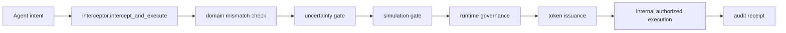

# Cognitive Firewall Aperture

Cognitive Firewall Aperture is runtime governance and uncertainty-pricing infrastructure for AI agent execution.

The aperture is the governed opening between agent reasoning and real-world execution. It determines how much action, if any, an agent is allowed to take.

## 30-second explanation

Cognitive-firewall is runtime governance middleware for consequential agent actions. It is not a generic prompt filter. It routes intent through deterministic domain checks, uncertainty bounds, governance policy/state checks, token issuance, and authorized execution with audit receipts.

Simulation does not predict the future. It stress-tests whether a speculative thesis remains coherent under adverse assumption changes.

This repository has shifted from **validator** to **governor**:

- validator: classify/risk score outputs
- governor: define and enforce pre-action execution boundaries

## Execution architecture



See also:

- [Threat model](docs/threat_model.md)
- [SPECULATE mode](docs/speculate_mode.md)
- [Architecture](docs/architecture.md)
- [Aperture model](docs/aperture_model.md)
- [API contract](docs/api_contract.md)
- [Demo outputs](docs/demo_outputs.md)
- [Ticket issuance](docs/ticket_issuance.md)

## Runtime state governance

Supported operation modes:

- `RESEARCH`
- `DRAFTING`
- `READ_ONLY`
- `TRANSACTION`
- `PRIVILEGED`
- `HUMAN_REVIEW`
- `QUARANTINED`

Policies can target states and transitions and can deny or permit state movement.

## Constraint hierarchy

Constraint levels:

- `HARD` (immutable)
- `SOFT` (override requires explicit justification)
- `GOAL` (task/session scoped)

Constraint packs (examples):

- `packs/financial_pack.json`
- `packs/privacy_pack.json`
- `packs/brand_pack.json`
- `packs/system_pack.json`

## Intent classes

Intent classes are separated from raw tool names:

- `DATA_ACCESS`
- `DATA_EXPORT`
- `COMMUNICATION`
- `PAYMENT`
- `TRADE`
- `SYSTEM_MODIFICATION`
- `AUTHORIZATION`
- `UNKNOWN`

## Sidecar-friendly API

`governance_service.py` exposes:

- `evaluate_request(...)`
- `issue_governance_token(...)`
- `execute(...)` (intentionally blocked; interceptor is required)

Designed for future FastAPI/gRPC sidecar deployment.

## Boundary API

Public boundary functions in `gate.py`:

```python
configure_authority(...)
register_tool(...)
issue_governance_token(intent, actor_context, tool_name, tool_args)
```

Public execution entry point:

```python
intercept_and_execute(intent, actor_context)
```

Execution path:
`intent -> interceptor -> domain mismatch -> uncertainty -> simulation -> governance -> token issuance -> internal authorized execution -> audit`.

`gate.execute(...)` is intentionally blocked and always returns `BLOCK` with reason `intercept_and_execute required` to prevent direct execution bypasses.

## What this proves

- denied requests cannot execute.
- execution requires governed token.
- tokens bind intent/tool/payload.
- state survives restart with SQLite store.
- secret access is denied unless explicitly allowed.

## ALLOW / SPECULATE / BLOCK

Cognitive-firewall does not eliminate speculation. It prevents speculation from pretending to be verified knowledge.

- `ALLOW`: confidence and critical assumptions support normal governed execution.
- `SPECULATE`: bounded execution mode; allocation caps are enforced before token issuance and execution proceeds only through interceptor and authorized internal gate execution.
- `BLOCK`: unsupported speculation, contradictory evidence, domain mismatch, or governance denial.

For speculative decisions, unsupported critical assumptions are blocked and requested allocation must remain under confidence-derived caps before governance token issuance.

## Simulation-Governed Speculation

Simulation does not verify the future. It tests whether a thesis survives across plausible futures.

When `run_simulation=true`, simulation is evaluated before token issuance. Simulation can support `SPECULATE` with a cap, or return `BLOCK`; it never upgrades uncertainty into automatic `ALLOW`.

## Quickstart

```bash
# install dependencies (Python 3.10+ recommended)
python -m venv .venv
source .venv/bin/activate

# run full tests
python -m unittest discover -s tests -v

# run deterministic domain mismatch demo
python demo_domain_mismatch.py

# run speculative mode demo
python demo_speculative_mode.py

# run simulation speculation demo
python demo_simulation_speculation.py

# run middleware demo
python middleware_example.py

# run benchmark
python benchmark_firewall_economics.py
```

## Installation

```bash
python -m venv .venv
source .venv/bin/activate
python -m pip install --upgrade pip
python -m pip install -r requirements.txt
```

## Running tests

```bash
python -m unittest discover -s tests -v
```

## Running demos

```bash
python demo_domain_mismatch.py
python demo_speculative_mode.py
python demo_simulation_speculation.py
python examples/mcp_demo.py
```

## Development rules

- Public execution entrypoint is `interceptor.intercept_and_execute(...)`.
- `gate.execute(...)` must remain blocked.
- `governance_service.execute(...)` must remain blocked.
- New execution paths must not bypass the interceptor.
- Boundary failures must return structured `BLOCK` responses.

See:

- [CONTRIBUTING.md](CONTRIBUTING.md)
- [SECURITY.md](SECURITY.md)
- [CHANGELOG.md](CHANGELOG.md)
- [LICENSE](LICENSE)

## Demo outputs (compact)

`python demo_domain_mismatch.py`:

```json
{
  "decision": "BLOCK",
  "reason": "DOMAIN_MISMATCH",
  "epistemic_status": "UNSTABLE",
  "violations": ["gravity"],
  "executed": false
}
```

### Windows PowerShell quickstart

```powershell
python -m venv .venv
.\.venv\Scripts\Activate.ps1
python -m unittest discover -s tests -v
python demo_domain_mismatch.py
python demo_speculative_mode.py
python demo_simulation_speculation.py
python examples/mcp_demo.py
```

`python demo_speculative_mode.py`:

```json
{
  "decision": "SPECULATE",
  "speculative": true,
  "confidence_average": 0.64,
  "max_allocation_pct": 2.0,
  "executed": true,
  "falsification_triggers": [
    "AI load growth decelerates below grid expansion",
    "PPA term lengths contract materially",
    "SMR deployment accelerates ahead of baseline"
  ]
}
```
