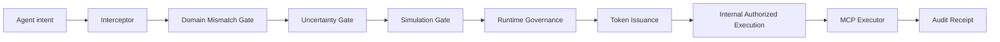

# Cognitive Firewall Aperture Runtime Architecture

This architecture is an agent execution aperture: it controls consequential tool execution between reasoning and action, and is not generic network security middleware.
